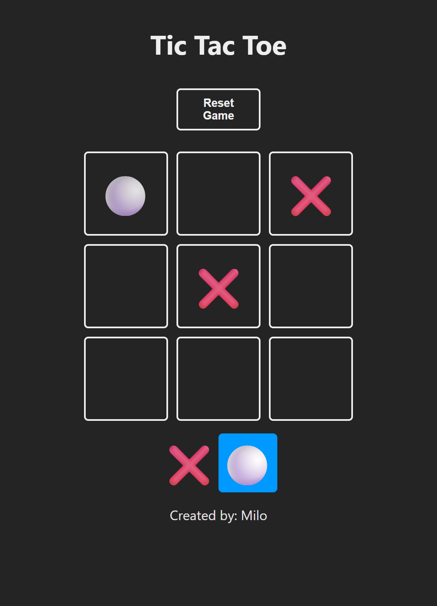
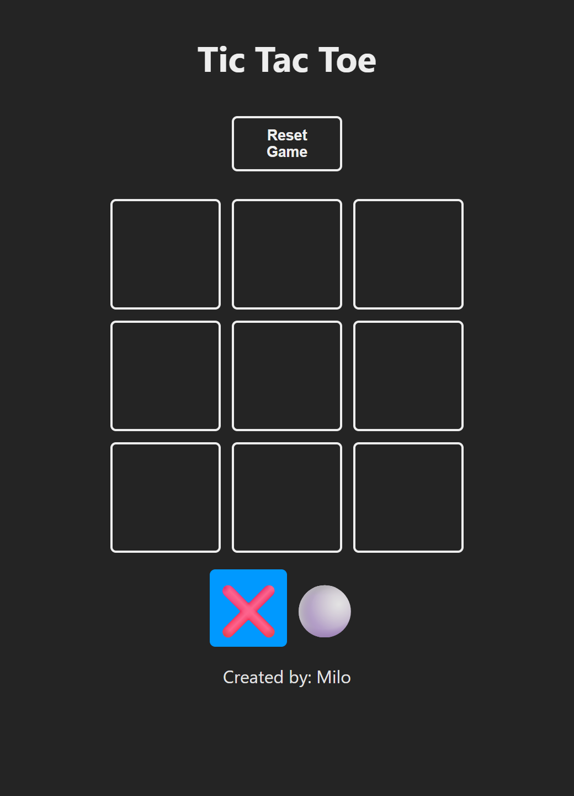
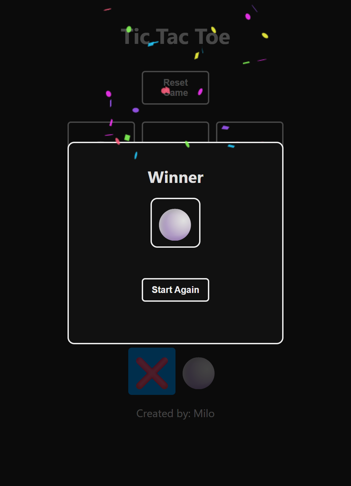
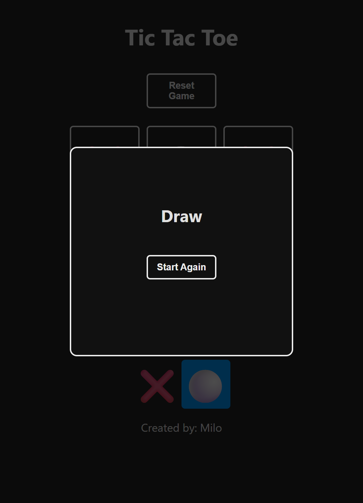

# Tic Tac Toe

Juego de triqui (tres en línea) para dos jugadores en el mismo navegador, hecho con React y Vite.

<p align="center">
  
</p>

## Capturas

| Inicio | Victoria | Empate |
|:---:|:---:|:---:|
|  |  |  |

## Funcionalidades

- Tablero de 3×3 con turnos alternos entre ❌ y ⚪.
- Indicador del jugador que tiene el turno.
- Detección de las 8 combinaciones ganadoras (3 filas, 3 columnas y 2 diagonales) y del empate.
- Ventana con el resultado, confeti al ganar y botón para jugar de nuevo.
- Botón **Reset Game** para reiniciar la partida en cualquier momento.
- La partida se guarda en `localStorage`: si recargas la página continúa donde iba, y si ya había terminado se sigue mostrando el resultado.

## Tecnologías

- [React 18](https://react.dev/)
- [Vite 5](https://vitejs.dev/) con `@vitejs/plugin-react-swc`
- [canvas-confetti](https://github.com/catdad/canvas-confetti) para la animación de victoria
- ESLint con las reglas de React y React Hooks

## Instalación y uso

Requiere [Node.js](https://nodejs.org/) 18 o superior.

```bash
git clone https://github.com/21Miloo/tic-tac-toe.git
cd tic-tac-toe
npm install
npm run dev
```

Luego abre la URL que muestra la consola (por defecto `http://localhost:5173`).

| Comando | Descripción |
|---|---|
| `npm run dev` | Servidor de desarrollo con recarga en caliente |
| `npm run build` | Genera la versión de producción en `dist/` |
| `npm run preview` | Sirve localmente la versión de producción |
| `npm run lint` | Revisa el código con ESLint |

## Estructura del proyecto

```
src/
├── main.jsx              # Punto de entrada: monta <App /> en el DOM
├── App.jsx               # Estado del juego (tablero, turno, ganador) y lógica de cada jugada
├── constants.js          # Fichas de cada jugador y combinaciones ganadoras
├── index.css             # Estilos del tablero, el indicador de turno y la ventana de resultado
├── logic/
│   └── board.js          # checkWinnerFrom (busca ganador) y checkEndGame (detecta empate)
└── components/
    ├── Square.jsx        # Casilla del tablero, también usada en el indicador de turno
    └── Winner.jsx        # Ventana de victoria o empate
```

## Cómo funciona

El estado del juego vive en `App.jsx` con tres valores:

- `board`: arreglo de 9 posiciones con `null`, `❌` o `⚪`.
- `turn`: ficha del jugador que tiene el turno.
- `winner`: `null` mientras se juega, la ficha ganadora si alguien gana, o `false` si hay empate.

En cada clic sobre una casilla vacía se crea un nuevo tablero con la jugada, se cambia el turno, se guardan ambos en `localStorage` y se revisa si la jugada produjo un ganador o un empate. Mientras haya un resultado, el tablero no acepta más jugadas.
